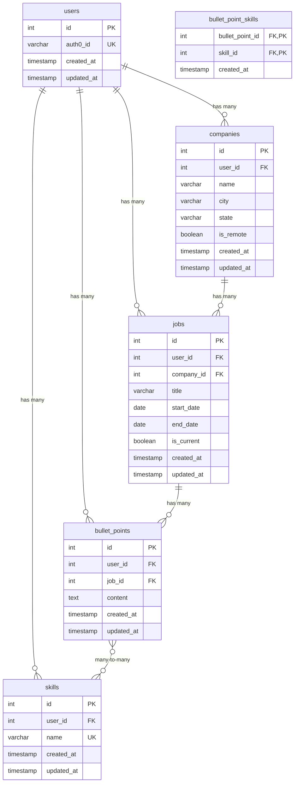

# Database Schema - Skillshot

## Relationships

### User → Companies (1:N)

- A user can have multiple companies
- Each company belongs to one user

### User → Jobs (1:N)

- A user can have multiple jobs
- Each job belongs to one user

### User → Skills (1:N)

- A user can have multiple skills
- Skills are unique per user (unique constraint on user_id + name)

### User → Bullet Points (1:N)

- A user can have multiple bullet points
- Each bullet point belongs to one user

### Company → Jobs (1:N)

- A company can have multiple jobs
- Each job belongs to one company
- Only one job per company can have is_current = true

### Job → Bullet Points (1:N)

- A job can have multiple bullet points
- Each bullet point belongs to one job

### Bullet Points ↔ Skills (N:M)

- A bullet point can be tagged with multiple skills
- A skill can be associated with multiple bullet points
- Linked through `bullet_point_skills` junction table

## Constraints

- `users.auth0_id` is unique
- `skills(user_id, name)` has a composite unique constraint
- `is_remote = true` → `city` and `state` should be null
- `is_current = true` → `end_date` should be null
- Cascading deletes: Deleting a user deletes all associated data
- Cascading deletes: Deleting a company deletes all associated jobs and bullet points
- Cascading deletes: Deleting a job deletes all associated bullet points

## Indexes

- `companies.user_id` (btree)
- `jobs.user_id` (btree)
- `jobs.company_id` (btree)
- `jobs.is_current` (btree)
- `skills.user_id` (btree)
- `skills.name` (btree)
- `bullet_points.user_id` (btree)
- `bullet_points.job_id` (btree)
- `bullet_point_skills.skill_id` (btree)
